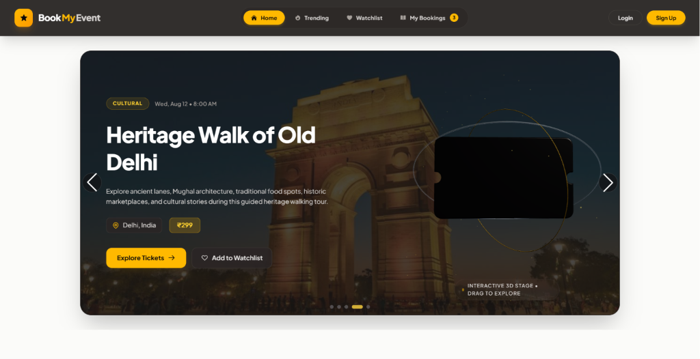
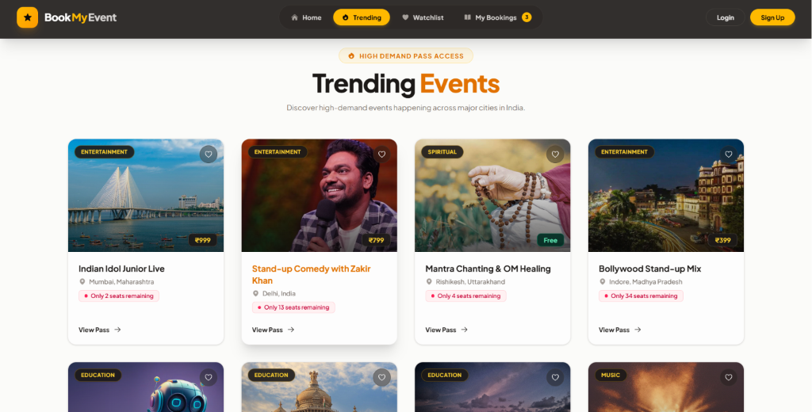
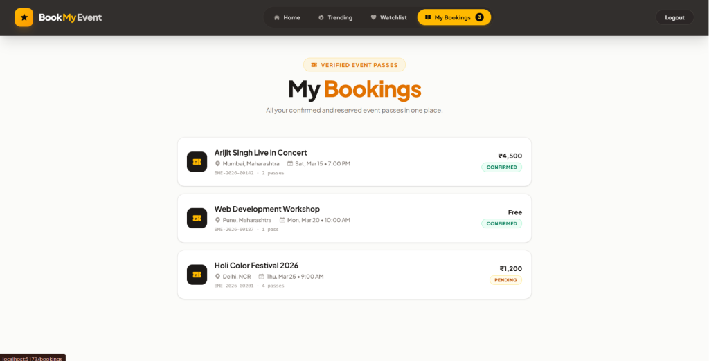
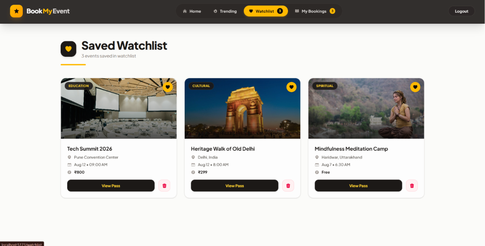

# 🎟️ BookMyEvent

[](https://react.dev/)
[](https://vitejs.dev/)
[](https://threejs.org/)
[](https://tailwindcss.com/)
[](https://nodejs.org/)
[](https://expressjs.com/)
[](https://www.mongodb.com/)
[](https://jwt.io/)

BookMyEvent is a full-stack, interactive event discovery and reservation platform built with React 19, Three.js WebGL, Node.js, Express 5, and MongoDB. It combines a 3D stage rendering engine and perspective tilt cards with multi-tiered seat selection, security workflows (6-digit OTP verification, dual-token JWT authentication), and administration tools.

---

## 📌 Overview

### 🎨 3D Visual Interactivity & Stage Experience
- **Interactive WebGL 3D Event Pass**: Three.js canvas featuring a floating 3D ticket geometry with rounded corners, custom side notches, physical materials (`MeshPhysicalMaterial`), clearcoat finish, gold metallic accents, dual orbital torus rings, ambient/directional lighting, 3D particle dust, and interactive cursor parallax.
- **3D Card Perspective Tilt**: Custom `Card3D` component utilizing CSS 3D perspective transforms (`rotateX`, `rotateY`, `scale3d`) and dynamic radial glare/sheen overlay tracking mouse movements.

### 🎟️ Event Discovery & Filtering
- **Category Filter Tabs**: Explore events filtered by type (`education`, `music`, `entertainment`, `cultural`, `spiritual`).
- **Live Regex Title Search**: Filter events dynamically by title using multi-keyword queries.
- **Event Sorting & Details**: Sort events by date or price, view event highlights, venue locations, remaining seat counts, and pricing badges.
- **Watchlist Manager**: Persist favorited events to user watchlists powered by React Context and LocalStorage persistence.

### 🪑 Seat Selection & Stage Mapping
- **Interactive Seat Map**: Stage layout visualization with tier indicator (VIP, Executive, Premium, General, Standard).
- **Seat Status Visualizer**: Status tracking (`AVAILABLE`, `BOOKED`, `SELECTED`) with seat count limit notifications (maximum 10 passes per order).
- **Automated Seat Generation**: Backend transactional utility to automatically generate seat matrices and tier pricing for stadium/auditorium seating configs.

### 🔒 Authentication & Account Management
- **Multi-Step Registration & OTP Verification**: Phone and email registration requiring 6-digit OTP verification.
- **Dual-Token Authentication**: JWT Access Tokens and Refresh Tokens for user authorization.
- **Password Recovery Pipeline**: Forgot password OTP generation, verification, password reset, and authenticated password change workflows.
- **Protected & Admin Routes**: Route guards (`ProtectedRoute`, `AdminRoute`) featuring a blurred modal overlay requiring sign-in for reserved views.

### 🛠️ Administration & Resiliency
- **Admin Dashboard**: Event creation interface supporting seat configuration, pricing, and category management.
- **API Fallback Layer**: Client API module (`events.js`) gracefully falls back to local static JSON data (`/data/events.json`) if backend service is unreachable.

---

## 🏗 Architecture

```
                                +-----------------------------------+
                                |     React 19 + Vite Frontend      |
                                | (Three.js 3D Canvas, Tailwind v4) |
                                +-----------------+-----------------+
                                                  |
                                                  | HTTP / REST (Axios Interceptors)
                                                  v
                                +-----------------+-----------------+
                                |     Express 5 Node.js API Server  |
                                |  (Modular Routes, JWT Middleware) |
                                +-----------------+-----------------+
                                                  |
                                                  | Mongoose ORM
                                                  v
                                +-----------------+-----------------+
                                |         MongoDB Database          |
                                |  (Users, Events, Seats, Bookings) |
                                +-----------------------------------+
```

### Module Breakdown

1. **Frontend Architecture (`client/`)**
   - Built on React 19 and Vite with Tailwind CSS v4 styling.
   - Global state managed via `AuthContext` (JWT session status) and `WatchlistContext` (bookmarked events).
   - Component organization: Pages (`Home`, `Watchlist`, `MyBookings`, `AdminPage`, Auth pages), Events (`EventsCard`, `SeatSelection`, `EventDetails`), Layout (`Navbar`, `Footer`), Common (`ThreeHeroCanvas`, `Card3D`, `Button`, `Input`).
   - Centralized Axios client (`axiosInstance.js`) with request interceptors for automated `Bearer <token>` headers and response interceptors for global `401 Unauthorized` handling.

2. **Backend Architecture (`backend/`)**
   - Node.js application using Express 5 framework with ES Modules (`"type": "module"`).
   - Modular structure located under `src/modules/`:
     - `auth`: User model, JWT token utilities, OTP generation/validation services, auth routes/controllers.
     - `events`: Event schema, Seat schema, seed generator, paginated search controller.
     - `bookings`: Booking schema and service.
     - `health`: Server health check endpoint.
   - Centralized middleware layer: `authProvider` (JWT token verification) and `isAdmin` (role-based route protection).

3. **Data Flow & Lifecycle**
   - Client sends authentication or query requests to `/api/v1/*`.
   - Express router invokes custom middleware (`authProvider` / `isAdmin`) for protected routes.
   - Services process operations using Mongoose transactions (e.g., event creation with bulk seat insertion via `insertMany`).
   - Standardized API responses returned via `ApiResponse` format, with unhandled runtime errors caught by the global Express error handler.

---

## 🛠 Tech Stack

### Frontend
- **Framework**: React `^19.2.0`
- **Build Tool**: Vite (`rolldown-vite` `7.2.5`)
- **Routing**: React Router DOM `^7.15.0`
- **Styling**: Tailwind CSS `^4.1.17`, `@tailwindcss/vite` `^4.1.17`
- **3D & Graphics**: Three.js `^0.185.1`
- **Data Fetching & State**: TanStack React Query `^5.100.9`, Axios `^1.16.0`, React Context API
- **UI Components & Icons**: Swiper `^12.0.3`, Heroicons `^2.2.0`, FontAwesome React `^3.1.1`

### Backend
- **Runtime & Framework**: Node.js, Express `^5.2.1`
- **Database ORM**: Mongoose `^9.9.0`
- **Authentication**: JSONWebToken `^9.0.3`, Bcrypt `^6.0.0`
- **Validation & Parsers**: Zod `^4.4.3`, Cookie Parser `^1.4.7`
- **Logging & Security**: Morgan `^1.11.0`, CORS `^2.8.6`, Dotenv `^17.4.2`
- **Integrations**: Razorpay `^2.9.8`, Redis `^6.1.0`

### Dev Tools & Utilities
- **Process Orchestration**: Concurrently `^9.1.2`
- **Development Server**: Nodemon `^3.1.14`
- **Linting**: ESLint `^9.39.1`

---

## 📂 Project Structure

```
BookMyEvent/
├── package.json                   # Root workspace manifest & concurrently script configuration
├── backend/                       # Express 5 REST API server
│   ├── BookMyEvent_Auth_Postman_Collection.json # Postman API test collection
│   ├── package.json               # Backend dependencies & dev scripts
│   └── src/
│       ├── index.js               # Application entrypoint & Express setup
│       ├── config/                # Environment config (env.js) & MongoDB connector (db.js)
│       ├── middleware/            # JWT Auth (middleware.js) & Role check (isAdmin.js)
│       ├── modules/               # Feature domain modules
│       │   ├── auth/              # Auth controllers, models, routes, services & OTP utils
│       │   ├── bookings/          # Booking model, controllers, routes & services
│       │   ├── events/            # Event model, Seat model, controllers, routes & services
│       │   └── health/            # Server status route & service
│       ├── seed/                  # Seeder script (seed.js) & dataset (events.json)
│       └── utils/                 # ApiError, ApiResponse, asyncHandler, generateSeats
└── client/                        # React 19 + Vite frontend
    ├── package.json               # Frontend dependencies & Vite scripts
    ├── vite.config.js             # Vite configuration
    ├── index.html                 # Main HTML template
    └── src/
        ├── App.jsx                # React Router view declarations
        ├── main.jsx               # Entrypoint mounting AuthProvider & WatchlistProvider
        ├── WatchlistContext.jsx   # Global Watchlist context provider
        ├── api/                   # Axios instance & API service functions
        ├── context/               # AuthContext provider
        └── components/            # React UI components
            ├── common/            # ThreeHeroCanvas, Card3D, Button, Input, Skeleton
            ├── events/            # Events list, EventsCard, SeatSelection, EventDetails
            ├── layout/            # Navbar, Footer
            └── pages/             # Home, Watchlist, Trending, MyBookings, AdminPage, Auth pages
```

---

## ⚙ Installation

### Prerequisites
- Node.js (v18.x or higher)
- npm (v9.x or higher)
- MongoDB instance (Local or MongoDB Atlas cluster)

### Steps

1. **Clone the Repository**
   ```bash
   git clone https://github.com/Kushal57-2005/Book-My-Event.git
   cd Book-My-Event
   ```

2. **Install Dependencies**
   Install root, backend, and client dependencies with a single command:
   ```bash
   npm run install:all
   ```

---

## 🔑 Environment Variables

Create `.env` files in both the `backend/` and `client/` directories based on the templates below.

### Backend (`backend/.env`)
```env
PORT=5000
MONGODB_URI=mongodb://localhost:27017/bookmyevent
JWT_SECRET=your_super_secret_jwt_key
JWT_ACCESS_EXPIRES=7d
JWT_REFRESH_EXPIRES=30d
CLIENT_URLS=http://localhost:5173,http://localhost:5174
```

### Frontend (`client/.env`)
```env
VITE_BACKEND_URL=http://localhost:5000/api/v1
```

> ⚠️ **Note**: Never expose secrets or commit actual `.env` files to public version control.

---

## 🚀 Running Locally

### 1. Seed Database (Optional)
Populate the database with sample events:
```bash
npm run seed
```

### 2. Start Development Servers
Run both backend Express server and frontend Vite dev server concurrently:
```bash
npm run dev
```
- Frontend will run on: `http://localhost:5173`
- Backend API will run on: `http://localhost:5000`

### Individual Execution Commands
- Start Server Only: `npm run dev:server`
- Start Client Only: `npm run dev:client`
- Build Client Bundle: `npm run build:client`

---

## 📡 API Overview

Base Endpoint: `/api/v1`

### Authentication (`/api/v1/auth`)
| Method | Endpoint | Access | Description |
|---|---|---|---|
| `POST` | `/auth/register` | Public | Register new user & generate 6-digit OTP |
| `POST` | `/auth/verifyOTP` | Public | Verify 6-digit OTP to set `isPhoneVerified = true` |
| `POST` | `/auth/login` | Public | Authenticate user & return JWT tokens |
| `POST` | `/auth/logout` | Protected | Invalidate user session & clear refresh token |
| `GET` | `/auth/getme` | Protected | Get authenticated user profile details |
| `POST` | `/auth/forget-password` | Public | Generate & send password reset OTP |
| `POST` | `/auth/verify-forget-password` | Public | Validate password reset OTP |
| `POST` | `/auth/reset-password` | Public | Update user password with new bcrypt hash |
| `POST` | `/auth/resend-OTP` | Protected | Generate fresh OTP if current OTP expired |
| `POST` | `/auth/change-password` | Protected | Change password for logged-in user |

### Events (`/api/v1/events`)
| Method | Endpoint | Access | Description |
|---|---|---|---|
| `GET` | `/events` | Public | Fetch paginated events with optional `type` filter and `search` query |
| `POST` | `/events/create` | Admin Only | Create new event and auto-generate seat matrices |
| `GET` | `/events/:eventId/seats` | Public | Fetch seating map and availability for a specific event |

### Health Check (`/api/v1/health`)
| Method | Endpoint | Access | Description |
|---|---|---|---|
| `GET` | `/health` | Public | Check operational status of the server |

---

## 🗄 Database

### Database Schemas (Mongoose)

#### 1. User Model (`User`)
- `fullName` (String, required, trimmed)
- `email` (String, trimmed, lowercase, unique, sparse)
- `phone` (String, unique, sparse)
- `password` (String, required, hidden from queries by default)
- `avatar` (String, default: `""`)
- `role` (String, enum: `["user", "admin"]`, default: `"user"`)
- `isEmailVerified` (Boolean, default: `false`)
- `isPhoneVerified` (Boolean, default: `false`)
- `otp` (String, select: `false`)
- `OtpExpires` (Date)
- `isForgotPasswordOTPVerified` (Boolean, default: `false`)
- `refreshToken` (String, select: `false`, default: `null`)
- `isActive` (Boolean, default: `true`)
- `timestamps` (`createdAt`, `updatedAt`)

#### 2. Event Model (`Event`)
- `name` (String, required, trimmed)
- `location` (String, required, trimmed)
- `img` (String, required)
- `time` (String, required)
- `daysFromNow` (Number, required, min: 0)
- `seatArrengement` (Boolean, default: `false`)
- `info` (String, required, trimmed)
- `type` (String, required, enum: `["education", "music", "entertainment", "cultural", "spiritual"]`)
- `seatCount` (Number, required, min: 0)
- `seatAvailable` (Number, required, min: 0)
- `isPaid` (Boolean, default: `false`)
- `price` (Number, default: 0, min: 0)
- `timestamps` (`createdAt`, `updatedAt`)

#### 3. Seat Model (`Seat`)
- `eventId` (ObjectId, ref: `"Event"`, required, indexed)
- `row` (String, required)
- `number` (Number, required)
- `seatCode` (String, required)
- `tier` (String, required)
- `price` (Number, required)
- `status` (String, enum: `["PENDING", "CONFIRMED", "CANCELLED", "EXPIRED"]`, default: `"AVAILABLE"`)
- `reservedBy` (ObjectId, ref: `"User"`, default: `null`)
- `reservationExpiresAt` (Date, default: `null`)
- `timestamps` (`createdAt`, `updatedAt`)
- *Compound Index*: `{ eventId: 1, seatCode: 1 }` (Unique)

#### 4. Booking Model (`Booking`)
- `userId` (ObjectId, ref: `"User"`, required)
- `eventId` (ObjectId, ref: `"Event"`, required)
- `seats` ([ObjectId], ref: `"Seat"`)
- `totalAmount` (Number, required)
- `status` (String, enum: `["PENDING", "CONFIRMED", "CANCELLED"]`, default: `"PENDING"`)
- `paymentId` (String)
- `reservationExpiresAt` (Date)
- `timestamps` (`createdAt`, `updatedAt`)

---

## 🔒 Security

- **JSON Web Token (JWT) Authentication**: Access tokens signed with `JWT_SECRET` and refresh tokens stored in user database record.
- **Bcrypt Password Hashing**: Passwords salted and hashed with 10 salt rounds prior to storage.
- **Role-Based Access Control (RBAC)**: Backend `isAdmin` middleware and frontend `AdminRoute` enforcement restricting administration capabilities to users with `role: "admin"`.
- **Protected Route Modal Guard**: Client-side route wrapper (`ProtectedRoute`) providing blurred backdrop modal restricting unauthenticated access.
- **6-Digit OTP Verification**: Expirable OTP system validating user ownership during registration and password reset.
- **CORS Protection**: Access control configured via Express CORS middleware restricted to origin list configured in `CLIENT_URLS`.
- **Data Sanitization**: Mongoose schemas configured with `select: false` on sensitive attributes (`password`, `otp`, `refreshToken`) to prevent sensitive leaks in JSON responses.

---

## 📸 Screenshots

### 🏠 3D Interactive Stage & Hero Carousel


### 🎟️ Trending & Featured Events Catalog


### 🎫 User Bookings Manager


### 💛 Saved Watchlist


---

## 🎯 Technical Challenges Solved

### 1. Interactive 3D WebGL Canvas Scene & Resource Cleanup
- **Challenge**: Rendering an interactive 3D metallic ticket pass in React without causing memory leaks or performance frame drops during window resizes and view navigation.
- **Implementation**: Built `ThreeHeroCanvas.jsx` using raw Three.js with WebGLRenderer. Configured ACESFilmic tone mapping, PCFSoftShadowMap, extruded shapes with rounded corner quadratic curves, torus orbital rings, and custom particle geometries. Implemented smooth lerp interpolation for mouse movement and an explicit cleanup handler disposing geometries, materials, particle buffers, and animation frames on unmount.

### 2. Mathematics of 3D Perspective Card Tilt & Radial Sheen
- **Challenge**: Creating a tactile, high-end 3D tilt effect on event cards that dynamically reflects lighting based on cursor position.
- **Implementation**: Developed `Card3D.jsx` which calculates bounding rect offsets to derive normalized center coordinates. Uses `perspective(1000px) rotateX(...) rotateY(...) scale3d(...)` paired with a radial gradient sheen (`radial-gradient(circle at X% Y%, ...)`) updating in real-time.

### 3. Transactional Seat Generation Engine
- **Challenge**: Bulk generating seat matrices with tier pricing (VIP, Executive, Premium, General) during event creation without data inconsistency.
- **Implementation**: Created `generateSeats.js` utility integrated into `createEventService.js`. Utilizes Mongoose ACID transactions (`session.startTransaction()`) to create the event and execute a bulk `Seat.insertMany(...)` write operation, rolling back entirely if seat generation fails.

### 4. Client API Graceful Fallback Architecture
- **Challenge**: Ensuring uninterrupted UI demonstration and event discovery even if backend services or database connections encounter downtime.
- **Implementation**: Structured `getEventsApi` to attempt Express backend endpoints first. If an API exception occurs, it seamlessly intercepts the error and falls back to a client-side `/data/events.json` static fetch, performing client-side regex search and category filtering.

---

## 🚀 Future Improvements

- **Redis-Based Seat Hold Mechanism**: Implement distributed Redis lock mechanisms with temporary TTLs during checkout to handle concurrent high-traffic seat contention.
- **Payment Gateway Integration**: Complete live Razorpay SDK transaction flow for instant booking confirmation.
- **Real-Time Seat Updates via WebSockets**: Add Socket.io integration to broadcast seat booking status changes live across connected client sessions.
- **QR Code E-Ticket Generator**: Generate downloadable PDF event passes with embedded QR codes upon booking completion.

---

## 📄 License

This project is licensed under the **ISC License**.
